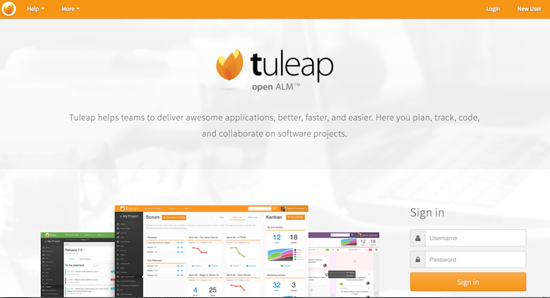

# Tuleap server, agile project management from Enalean

[Tuleap](https://www.tuleap.org/) is a software platform for project management that enables managers and developers to utilize diverse development methodologies including Agile, traditional, or hybrid or custom processes. It helps organizations meet industry standards like Capability Maturity Model Integration (CMMI) and ITIL. Tuleap facilitates the planning of software releases, the prioritization of business requirements, the assignment of tasks to project members, the monitoring of project progress, and the creation of reports.[7] It features site-wide trackers and real-time reports on risks, requirements, tasks, bugs, change requests, support requests, user stories.[8] It supports Kanban, Scrum, and hybrid methodologies in project management.

The objective of this use case is to deploy a Tuleap server, at the [Managed Cloud Platform from Dimension Data](http://cloud.dimensiondata.com/eu/en/).
This is done with [plumbery](https://docs.mcp-services.net/display/PLUM/Plumbery) and a template that is provided below.

## Requirements for this use case

* Select a MCP location
* Add a Network Domain
* Add an Ethernet network
* Deploy a CentOS node
* Add a virtual disk of 50 GB
* Monitor this server in the real-time dashboard provided by Dimension Data
* Assign a public IPv4 address
* Add address translation to ensure end-to-end IP connectivity
* Add firewall rule to accept TCP traffic on ssh and web ports
* Combine the virtual disks into a single expanded logical volume (LVM)
* Update the operating system
* Synchronise node clock with NTP
* Install a new SSH key to secure remote communications
* Configure SSH to reject passwords and to prevent access from root account
* Install and configure Tuleap

## Fittings plan

[Click here to read fittings.yaml](fittings.yaml)

## Deployment command

    $ python -m plumbery fittings.yaml deploy

This command builds fittings as per the provided plan, starts the server
and bootstraps it. Look at messages displayed by plumbery while it is
working, so you can monitor what's happening.

## Follow-up commands

At the end of the deployment, plumbery will display on screen some instructions
to help you move forward. You can ask plumbery to display this information
at any time with the following command:

    $ python -m plumbery fittings.yaml information

Open a browser window and paste the public address reported by plumbery.
You should receive a welcome HTML page in return.

From there you can create an account and start a first project.
Check [Tuleap Tutorials, Tips & Tricks](https://www.tuleap.org/tuleap-tutos-tips-tricks) for a quick start.

## Destruction commands

Launch following command to remove all resources involved in the fittings plan:

    $ python -m plumbery fittings.yaml dispose

## Use case status

- [x] Work as expected

## See also

- [Application services with plumbery](../)
- [All plumbery fittings plans](../../)

