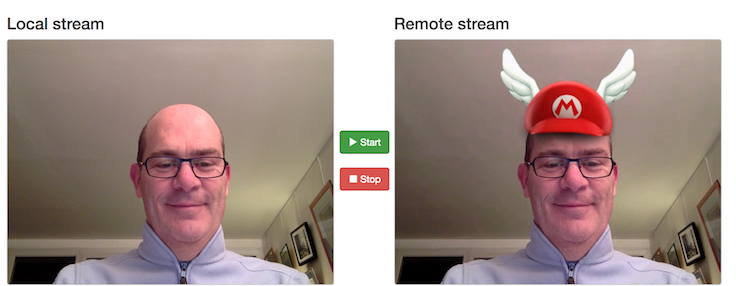
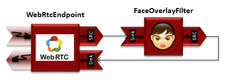

# Kurento Media Server (KMS), for private WebRTC applications

[Kurento](http://www.kurento.org/) is a WebRTC media server and a set of client APIs making simple the development of advanced video applications for WWW and smartphone platforms. Kurento Media Server features include group communications, transcoding, recording, mixing, broadcasting and routing of audiovisual flows.

As a differential feature, Kurento Media Server also provides advanced media processing capabilities involving computer vision, video indexing, augmented reality and speech analysis. Kurento modular architecture makes simple the integration of third party media processing algorithms (i.e. speech recognition, sentiment analysis, face recognition, etc.), which can be transparently used by application developers as the rest of Kurento built-in features.

The objective of this use case is to deploy Kurento Media Server (KMS) on a single node, at the [Managed Cloud Platform from Dimension Data](http://cloud.dimensiondata.com/eu/en/).
This is done with [plumbery](https://docs.mcp-services.net/display/PLUM/Plumbery) and a template that is provided below.

Also, we deploy a sample web application that demonstrates computer vision and augmented reality techniques.

## Requirements for this use case

There are a number of actions involved in the overall deployment, and plumbery
automates all of them:

* Select a MCP location
* Add a Network Domain
* Add an Ethernet network
* Deploy a Ubuntu server
* Adjust computing capacity (CPU and RAM) to provide enough horse power
* Add a virtual disk to support session recording
* Monitor this server in the real-time dashboard provided by Dimension Data
* Assign a public IPv4 address
* Add address translation to ensure end-to-end IP connectivity
* Add firewall rule to accept TCP and UDP traffic from multiple ports
* Expand system logical volume (LVM) with additional virtual disk
* Update the operating system
* Synchronise node clock
* Install a new SSH key to secure remote communications
* Configure SSH to reject authentication based on passwords
* Update `etc/hosts` to bind addresses to host names
* Download and install Kurento Media Server
* Download and install an application from Kurento tutorials
* Finalise the setup

## Fittings plan

[Click here to read fittings.yaml](fittings.yaml)

## Deployment command

    $ python -m plumbery fittings.yaml deploy

This command builds fittings as per the provided plan, starts the server
and bootstraps it. Look at messages displayed by plumbery while it is
working, so you can monitor what's happening.

## Follow-up commands

At the end of the deployment, plumbery displays on screen some instructions
to help you move forward. You can ask plumbery to display this information
at any time with the following command:

    $ python -m plumbery fittings.yaml information

In a nutshell, you will use Chrome or Firefox as web browser that supports WebRTC.
Copy and paste the two links displayed by plumbery. On the first link you will accept the self-signed certificate used for real-time websockets communication.

    https://<public_ip_address>:8433/kurento

This is returning a blank page in the browser. On the second link you will accept the self-signed certificate and launch the web application itself.

    https://<public_ip_address>:8443

Then click on the Start button, and accept the usage of the webcam. Suddenly your face is mirrored with a funny hat on top of it.

This application uses computer vision and augmented reality techniques to add an image on top of detected faces.

The interface of the application (an HTML web page) is composed by two HTML5 video tags: one for the video camera stream (the local client-side stream) and other for the mirror (the remote stream). The video camera stream is sent to the Kurento Media Server, processed and then is returned to the client as a remote stream.

On the server, the WebRTC building block is tied with an overlay filter in the following media pipeline:

The FaceOverlayFilter is a sophisticated component that detects faces in the video stream and puts an image on top of them. In this demo the filter is configured to put a Super Mario hat.

This application is coming out of the box from [Kurento Tutorials](http://doc-kurento.readthedocs.io/en/stable/tutorials.html) where you can find more details and other innovative ideas from the Kurento team.

## Destruction commands

Launch following command to remove all resources involved in the fittings plan:

    $ python -m plumbery fittings.yaml dispose

## Use case status

- [X] Work as expected

## See also

- [Collaboration services with plumbery](../)
- [All plumbery fittings plans](../../)

