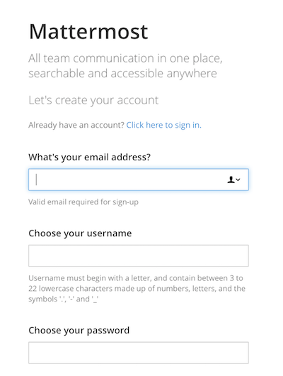

# Mattermost, self-hosted chat server for private teams

[Mattermost](https://about.mattermost.com) is a modern, self-hosted workplace messaging solution. It is installed by your IT team on your own servers and fully controlled by your organization.

In this use case we demonstrate how to create a Mattermost server
on a single node at the [Managed Cloud Platform from Dimension Data](http://cloud.dimensiondata.com/eu/en/).
This is done with [plumbery](https://developer.dimensiondata.com/display/PLUM/Plumbery) and a template that is provided below.

## Requirements for this use case

* Go to a MCP location
* Add a Network Domain
* Add an Ethernet network
* Deploy a Ubuntu server
* Provide with enough CPU and RAM
* Add a virtual disk of 50 GB
* Monitor this server in the real-time dashboard
* Assign a public IPv4 address
* Add address translation to ensure end-to-end IP connectivity
* Add firewall rule to accept TCP traffic on port 22 (ssh) and 8065 (web)
* Use the virtual disk to expand logical volume (LVM)
* Update the operating system
* Synhronise node clock
* Edit the host name and the `/etc/hosts` file
* Install a new SSH key to secure remote communications
* Configure SSH to reject passwords and to prevent access from root account
* Install Mattermost
* Launch it

## Fittings plan

[Click here to read fittings.yaml](fittings.yaml)

## Deployment command

    $ python -m plumbery fittings.yaml deploy

This command will build fittings as per the provided plan, start the server
and bootstrap it.

## Follow-up commands

You can find the public address assigned to the Mattermost node like this:

    $ python -m plumbery fittings.yaml information

Copy the web link into some browser to access the server and to finalize the setup.

Share the link with people around you so that you can chat together.

## Destruction commands

Launch following command to remove all resources involved in the fittings plan:

    $ python -m plumbery fittings.yaml dispose

## Use case status

- [x] Work as expected

## See also

- [Collaboration services with plumbery](../)
- [All plumbery fittings plan](../../)

