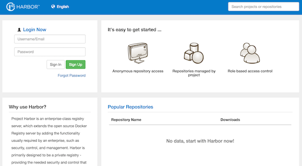
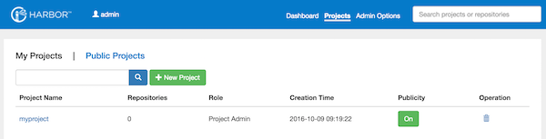

# Enterprise-class container registry server with VMware Harbor

The objective of this use case is to deploy a VMware Harbor server, at the [Managed Cloud Platform from Dimension Data](http://cloud.dimensiondata.com/eu/en/).
This is done with [plumbery](https://docs.mcp-services.net/display/PLUM/Plumbery) and a template that is provided below.

[Project Harbor](https://github.com/vmware/harbor) is an enterprise-class registry server that stores and distributes Docker images. Harbor extends the open source Docker Distribution by adding the functionalities usually required by an enterprise, such as security, identity and management. As an enterprise private registry, Harbor offers better performance and security. Having a registry closer to the build and run environment improves the image transfer efficiency. Harbor supports the setup of multiple registries and has images replicated between them. With Harbor, the images are stored within the private registry, keeping the bits and intellectual properties behind the company firewall. In addition, Harbor offers advanced security features, such as user management, access control and activity auditing.

In this tutorial we create a standalone VMware Harbor server so that we can play with it afterwards.

## Requirements for this use case

* Select a MCP location
* Add a Network Domain
* Add an Ethernet network
* Deploy a Ubuntu server
* Provide 4 CPU and 8 GB of RAM
* Add a virtual disk of 100 GB
* Monitor this server in the real-time dashboard provided by Dimension Data
* Assign a public IPv4 address
* Add address translation to ensure end-to-end IP connectivity
* Add firewall rule to accept TCP traffic on ports 22 (ssh), 80 and 443 (web)
* Combine the virtual disks into a single expanded logical volume (LVM)
* Update the operating system
* Synchronise node clock with NTP
* Install a new SSH key to secure remote communications
* Configure SSH to reject passwords and to prevent access from root account
* Update `etc/hosts`
* Install Docker Engine
* Install Docker Compose
* Install VMware Harbor and configure it

## Fittings plan

[Click here to read fittings.yaml](fittings.yaml)

## Deployment command

    $ python -m plumbery fittings.yaml deploy

This command will build fittings as per the provided plan, start the server
and bootstrap it. Look at messages displayed by plumbery while it is
working, so you can monitor what's happening.

## Follow-up commands

At the end of the deployment, plumbery will display on screen some instructions
to help you move forward. You can ask plumbery to display this information
at any time with the following command:

    $ python -m plumbery fittings.yaml information

The Harbor console is accessed from the web link provided by plumbery.

To sign in you can use `admin` and the random password mentioned by plumbery.
From there use the web console to manage your private environment. For example,
create a new project for your team.

Look at the main [VMware Harbor project page](https://github.com/vmware/harbor) to find additional information.

## Troubleshooting commands

If something goes wrong, you can always connect directly from the command line.

    $ ssh ubuntu@<ipv4_here>

You will have to accept the new host, and authentication will be based on
the SSH key communicated to the node by Plumbery.

    $ docker info
    $ docker run hello-world

## Destruction commands

Launch following command to remove all resources involved in the fittings plan:

    $ python -m plumbery fittings.yaml dispose

## Use case status

- [x] Work as expected

## See also

- [Containers with plumbery](../)
- [All plumbery fittings plans](../../)

