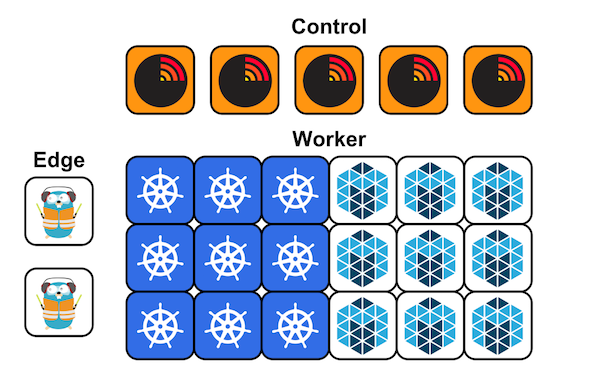

#Mantl cluster, with 3 control nodes, 2 edge nodes, 3 Kubernetes worker nodes and 3 generic worker nodes

The objective of this use case is to deploy a Mantl cluster at the [Managed Cloud Platform from Dimension Data](http://cloud.dimensiondata.com/eu/en/).
This is done with [plumbery](https://docs.mcp-services.net/display/PLUM/Plumbery) and a template that is provided below.

[Mantl](http://mantl.io/) is a modern, batteries included platform for rapidly deploying globally distributed services.
It consists of a consolidated set of components that, together, support efficient modern micro-services architectures.

Core Components:

* Consul for service discovery
* Vault for managing secrets
* Mesos cluster manager for efficient resource isolation and sharing across distributed services
* Marathon for cluster management of long running containerized services
* Kubernetes for managing, organizing, and scheduling containers
* Terraform deployment to multiple cloud providers
* Docker container runtime
* Traefik for proxying external traffic
* mesos-consul populating Consul service discovery with Mesos tasks
* Mantl API easily install supported Mesos frameworks on Mantl
* Mantl UI a beautiful administrative interface to Mantl

Addons:

* ELK Stack for log collection and analysis
* GlusterFS for container volume storage
* Docker Swarm for clustering Docker daemons between networked hosts
* etcd, distributed key-value store for Calico
* Calico, a new kind of virtual network
* collectd for metrics collection
* Chronos a distributed task scheduler
* Kong for managing APIs

Plumbery is tasked with the dirty work, which is to deploy and configure resources
at the Managed Cloud Platform. Plumbery also bootstrap all nodes with shared SSH keys and update `/etc/hosts` as well.
Plumbery installs Mantl on a dedicated node and generates there an inventory of all nodes that ansible can use.
And of course, in the end plumbery triggers ansible so that Mantl components are pushed and configured at all nodes.

## Requirements for this use case

* Select a MCP location
* Add a Network Domain
* Add an Ethernet network
* Deploy 12 CentOS nodes with various CPU RAM and disk configurations
* Tag each node by anticipation of their respective roles in Mantl architecture
* Monitor all nodes in the real-time dashboard provided by Dimension Data
* Assign a public IPv4 address to each node
* Add address translation rules to ensure Internet connectivity with each node
* Add firewall rule to accept ping and ssh traffic for each node
* Add other firewall rules to enable web traffic
* Extend LVM disks with additional resources given to each node
* Update the operating system of each node
* Synchronise node clock of each node
* Install shared SSH keys to allow easy and password-less communications across nodes
* Prevent password authentication with SSH
* Update `etc/hosts` and `hostnames` to bind private and public addresses to host names
* Install Mantl, ansible, plumbery and various tools on a separate ansible node
* On the ansible node, use plumbery to generate an inventory of all nodes, including their names, IP addresses and roles
* From this node, use ansible playbooks to deploy and configure components across the cluster

## Fittings plan

[Click here to read fittings.yaml](fittings.yaml)

## Deployment command

    $ python -m plumbery fittings.yaml deploy

This command will build fittings as per the provided plan, start nodes
and bootstrap them. Look at messages displayed by plumbery while it is
working, so you can monitor what's happening.

## Follow-up commands

At the end of the deployment, plumbery will display on screen some instructions
to help you move forward. You can ask plumbery to display this information
at any time with the following command:

    $ python -m plumbery fittings.yaml information

In this use case you can use the public IPv4 assigned to any control node
in a web browser, and access the Mantl console for the cluster.

    https://<ipv4_of_any_control_node>

## Destruction commands

Launch following command to remove all resources involved in the fittings plan:

    $ python -m plumbery fittings.yaml dispose

## Use case status

- [x] Work as expected

## See also

- [Containers with plumbery](../)
- [All plumbery fittings plan](../../)

