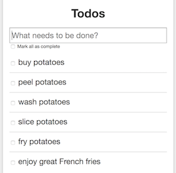

# RethinkDB, geo-distributed JSON store

[RethinkDB](https://rethinkdb.com/) is an open source, NoSQL, distributed document-oriented database. The database stores JSON documents with dynamic schemas, and is designed to facilitate pushing real-time updates for query results to applications.

The objective here is to deploy multiple RethinkDB servers, at the [Managed Cloud Platform from Dimension Data](http://cloud.dimensiondata.com/eu/en/).
This is done with [plumbery](https://docs.mcp-services.net/display/PLUM/Plumbery) and a template that is provided below.

With this use case we prepare a ready-to-use geo-distributed cluster of 5 rethinkDB nodes. One node is used to bootstrap the cluster. The four other nodes implemented a distributed database that is replicated automatically. A small demo web application is installed at all nodes.

Synchronisation trafic across nodes is taking place over the private IPv6 infrastructure that connects all MCP locations. Then each web application is given a public IP4 address to handle traffic coming from local Internet users.

This design delivers a fault-tolerant real-time application where data is replicated asynchronously, and multiple application endpoints are available.

## Requirements for this use case

* Select multiple MCP locations
* Add a Network Domain to each MCP locations
* Add two Ethernet networks to the Amsterdam location, and one Ethernet network to others
* Deploy 1 Ubuntu node to each network
* Provide enough CPU, RAM and disk to each node, as defined by parameters
* Monitor nodes in the real-time dashboard provided by Dimension Data
* Add firewall rules to allow private IPv6 traffic between MCP locations
* Assign a public IPv4 address to each node
* Add address translation to ensure end-to-end IP connectivity over Internet
* Add firewall rules to accept TCP traffic for ssh and for web consoles
* Expand system storage (LVM) with additional disk
* Update the operating system
* Synchronise node clock with NTP
* Install a new SSH key to secure remote communications
* Configure SSH to reject passwords and to prevent access from root account
* Update `etc/hosts` and `hostname` to bind network addresses to host names
* Install RethinkDB at each node
* Install a demo web application at each node
* From the seeding node, create a database for the web application

## Fittings plan

[Click here to read fittings.yaml](fittings.yaml)

## Deployment command

    $ python -m plumbery fittings.yaml deploy

This command will build fittings as per the provided plan, start the cluster
and bootstrap it. Look at messages displayed by plumbery while it is
working, so you can monitor what's happening.

## Follow-up commands

At the end of the deployment, plumbery will display some instructions
to help you move forward. You can ask plumbery to display this information
at any time with the following command:

    $ python -m plumbery fittings.yaml information

In this demonstration, you will use a web browser to administrate the cluster, and to use the application.
Copy and paste the first two links displayed by plumbery. On the first link you will access the web console
of the seeding node.

    https://<public_ip_address_of_EU7rethinkSeed>:8080

There you access the main management dashboard of the cluster.

Click on the Servers tab and check that all servers are contributing to the cluster over private IPv6.

Click on the Tables tab and select the todo table. Then click on the Reconfigure button and augment the number of replicas.

After the replication of data across all nodes you get a fully distributed geo-cluster of 5 nodes across 4 different locations.

Now that the infrastructure is up and running, we will use for real in a small web application. The web front-end has been installed at every node, so you can use any public IP address mentioned by plumbery. We will start with the endpoint in Amsterdam:

    https://<public_ip_address_of_EU7rethink01>:5000

There you start with an empty list of todos.

As an example, you could add every step required for the production of delicious French fries:
- buy potatoes
- peel potatoes
- wash potatoes
- slice potatoes
- fry potatoes

The interface is updated progressively, and data is replicated across the cluster in the background. We prove it with another web browser pointed to the endpoint in another location, let say, Brussels:

    https://<public_ip_address_of_EU9rethink01>:5000

The list displayed in Brussels is reflecting data entered in Amsterdam.

Of course, additional changes in Brussels are reflected to Asmterdam too. Check 2 or 3 items, then reload the page on Dutch side to show evidence of it.

## Destruction commands

Launch following command to remove all resources involved in the fittings plan:

    $ python -m plumbery fittings.yaml dispose

## Use case status

- [X] Work as expected

## See also

- [Database services with plumbery](../)
- [All plumbery fittings plans](../../)

