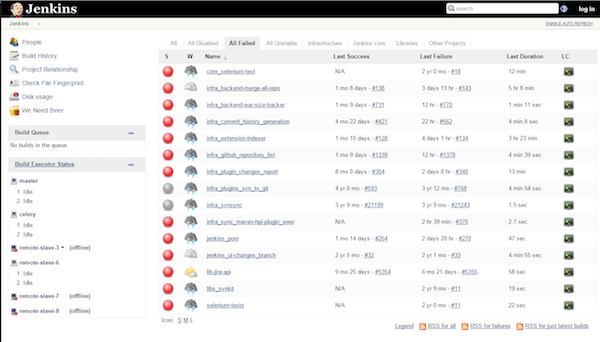

# Jenkins automation server

The objective here is to deploy a Jenkins server, at the [Managed Cloud Platform from Dimension Data](http://cloud.dimensiondata.com/eu/en/).
This is done with [plumbery](https://developer.dimensiondata.com/display/PLUM/Plumbery) and a template that is provided below.

[Jenkins](https://jenkins.io/) is an open source automation server written in Java.
Jenkins helps automating the non-human part of the whole software development process, with now common things like Continuous Integration, but by further empowering teams to implement the technical part of a Continuous Delivery. It is a server-based system running in a servlet container such as Apache Tomcat. It supports SCM tools including AccuRev, CVS, Subversion, Git, Mercurial, Perforce, Clearcase and RTC, and can execute Apache Ant and Apache Maven based projects as well as arbitrary shell scripts and Windows batch commands.

## Requirements for this use case

* Select a MCP location
* Add a Network Domain
* Add an Ethernet network
* Deploy a Ubuntu node
* Provide enough CPU, RAM and disk to each node, as defined by parameters
* Monitor nodes in the real-time dashboard provided by Dimension Data
* Assign a public IPv4 address to each node
* Add address translation to ensure end-to-end IP connectivity
* Add firewall rule to accept TCP traffic for ssh and for web consoles
* Expand system storage (LVM) with additional disk
* Update the operating system
* Synchronise node clock with NTP
* Install a new SSH key to secure remote communications
* Configure SSH to reject passwords and to prevent access from root account
* Update `etc/hosts` and `hostname` to bind network addresses to host names
* Install Java and Jenkins

## Fittings plan

[Click here to read fittings.yaml](fittings.yaml)

## Deployment command

    $ python -m plumbery fittings.yaml deploy

This command will build fittings as per the provided plan, start the node
and bootstrap it. Look at messages displayed by plumbery while it is
working, so you can monitor what's happening.

## Follow-up commands

At the end of the deployment, plumbery will display on screen some instructions
to help you move forward. You can ask plumbery to display this information
at any time with the following command:

    $ python -m plumbery fittings.yaml information

In this use case you first read the random secret created by the Jenkins installer.

    $ ssh ubuntu@<ipv4_here>
    $ sudo cat /var/lib/jenkins/secrets/initialAdminPassword

Then you go the web interface of Jenkins as per instruction from plumbery,
and provide the random secret to connect. Voilà, Jenkins is ready to go!

After you finalize the configuration and play a bit with the tool you may end
with something like the following:

## Destruction commands

Launch following command to remove all resources involved in the fittings plan:

    $ python -m plumbery fittings.yaml dispose

## Use case status

- [X] Work as expected

## See also

- [DevOps services with plumbery](../)
- [All plumbery fittings plans](../../)

