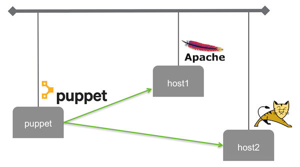
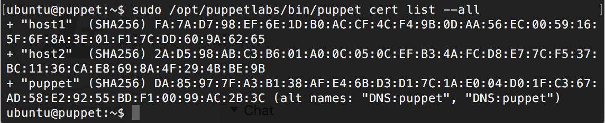
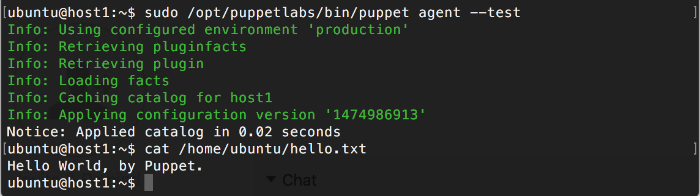
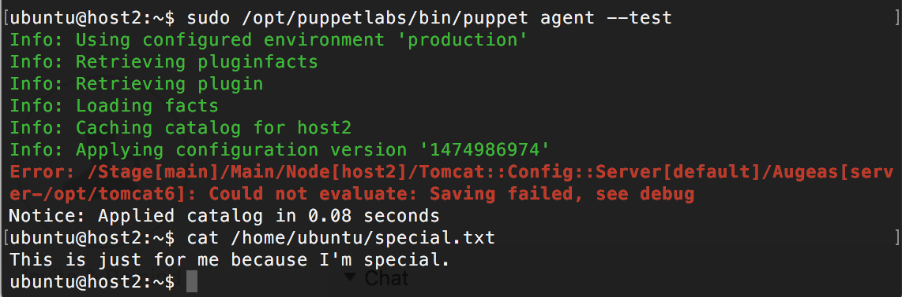
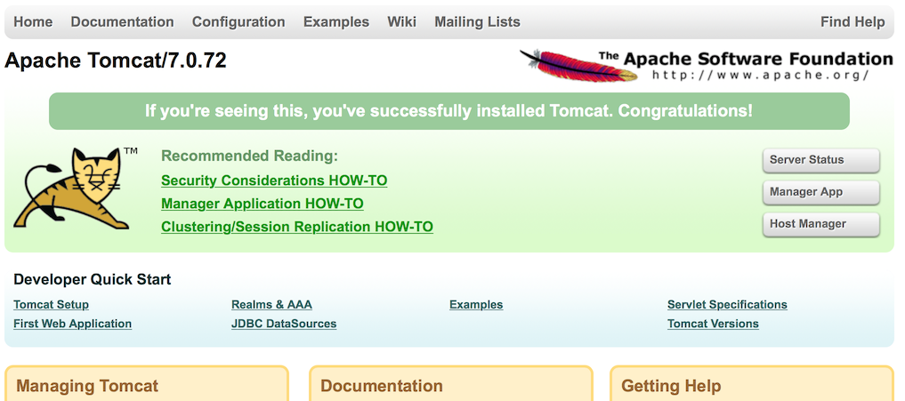

# Puppet server, and 2 hosts configured by the server

The objective of this use case is to deploy a Puppet master server and companion hosts, at the [Managed Cloud Platform from Dimension Data](http://cloud.dimensiondata.com/eu/en/).
This is done with [plumbery](https://developer.dimensiondata.com/display/PLUM/Plumbery) and a template that is provided below.

[Puppet](https://puppet.com/) is an open source systems management tool for centralizing and automating configuration management.
Puppet has two layers: a configuration language to describe how the hosts and services should look, and an abstraction layer that allows the administrator to implement the configuration on a variety of Unix and Linux platforms. Administrators can encode the configuration of a service as a policy, which Puppet then monitors and enforces.

Puppet software is ran at all hosts deployed by this template. One node is the central Puppet server, that stores configuration data
to be enforced at other nodes. Plumbery also creates two generic nodes, and connect them to the master server.
After that the Puppet master server has full control of the software configuration of the other nodes.
Puppet installs and configure Apache web server at 'host1', and Tomcat at 'host2'.
In other terms, this use case demonstrates practical infrastructure-as-code, bootstrapped by plumbery.

## Requirements for this use case

* Select a MCP location
* Add a Network Domain
* Add an Ethernet network
* Deploy a Ubuntu node for a Puppet server
* Deploy two other nodes that will be configured by Puppet
* Adjust CPU and RAM of each node
* Add a virtual disk to each node
* Monitor each node in the real-time dashboard provided by Dimension Data
* Assign a public IPv4 address to each node
* Add address translation to ensure connectivity to each node over the Internet
* Add firewall rules to accept TCP traffic on port 22 (ssh), 80 and 8080 (web)
* Combine the virtual disks into a single expanded logical volume (LVM) at each node
* Update the operating system to the last version at each node
* Synchronise node clock with NTP at each node
* Update `/etc/hosts` to let each node knows about the others
* Create a SSH key and distribute it to each node
* Configure SSH to reject passwords and to prevent access from root account
* Install Puppet server at the node 'puppet'
* Provide Puppet server with instructions to configure other hosts
* Install Puppet agent at 'host1' and 'host2'
* Pair Puppet agents with the server over the network

## Fittings plan

[Click here to read fittings.yaml](fittings.yaml)

## Deployment command

    $ python -m plumbery fittings.yaml deploy

This command will build fittings as per the provided plan, start the server
and bootstrap it. Look at messages displayed by plumbery while it is
working, so you can monitor what's happening.

## Follow-up commands

At the end of the deployment, plumbery will display on screen some instructions
to help you move forward. You can ask plumbery to display this information
at any time with the following command:

    $ python -m plumbery fittings.yaml information

Connect over SSH to the Puppet master node, which is named 'puppet'. From there
you can check the full list of nodes under control. Normally 'host1' and 'host2'
should be part of the list, and feature a small '+' sign aside that proves a trusted
relationship with 'puppet'.

Then you can connect to 'host1', and check the full configuration sequence.
The file `/home/ubuntu/hello.txt` is set remotely from 'puppet'.

Ok, fine, now move on to 'host2' and do the same, but with a more ambitious configuration.
This is because 'puppet' has special instructions for 'host2'.

Open a browser window and paste the public link for 'host2' that is reported by plumbery.
This demonstrates that Tomcat has been successfully installed and configured by Puppet.

## Destruction commands

Launch following command to remove all resources involved in the fittings plan:

    $ python -m plumbery fittings.yaml dispose

## Use case status

- [X] Work as expected

## See also

- [DevOps services with plumbery](../)
- [All plumbery fittings plans](../../)

