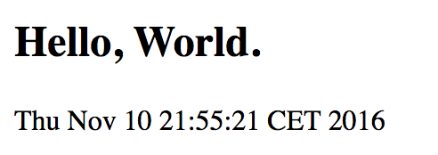
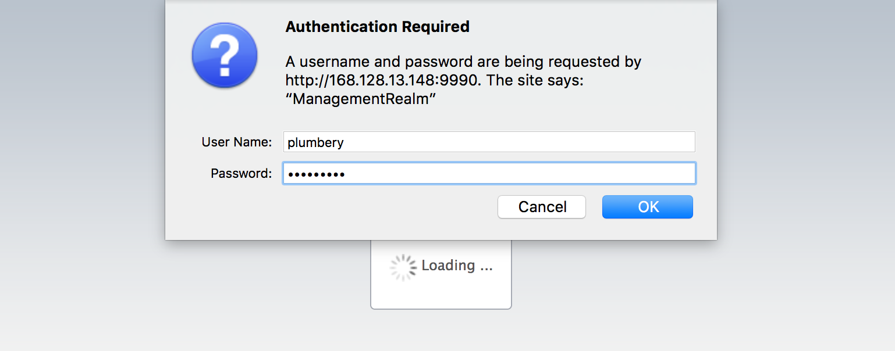
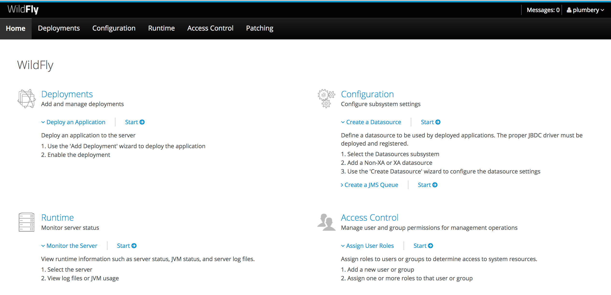

# WildFly application server, for your Java code

[Wildfly](http://wildfly.org/), formerly known as JBoss AS, or simply JBoss, is an application server authored by JBoss, now developed by Red Hat. WildFly is written in Java, and implements the Java Platform, Enterprise Edition (Java EE) specification. It runs on multiple platforms.

The objective of this use case is to deploy a Wildfly application server, at the [Managed Cloud Platform from Dimension Data](http://cloud.dimensiondata.com/eu/en/).
This is done with [plumbery](https://docs.mcp-services.net/display/PLUM/Plumbery) and a template that is provided below.

## Requirements for this use case

* Select a MCP location
* Add a Network Domain
* Add an Ethernet network
* Deploy a CentOS server
* Provide 4 CPU and 12 GB of RAM
* Add a virtual disk of 100 GB
* Monitor this server in the real-time dashboard provided by Dimension Data
* Assign a public IPv4 address
* Add address translation to ensure end-to-end IP connectivity
* Add firewall rule to accept TCP traffic on ports 22 (ssh), 80 and 443 (web)
* Combine the virtual disks into a single expanded logical volume (LVM)
* Update the operating system
* Synchronise node clock with NTP
* Install a new SSH key to secure remote communications
* Configure SSH to reject passwords and to prevent access from root account
* Update `etc/hosts`
* Install Java JDK
* Install WildFly
* Add a sample "Hello World" JSP page
* Install Maven as a goodie

## Fittings plan

[Click here to read fittings.yaml](fittings.yaml)

## Deployment command

    $ python -m plumbery fittings.yaml deploy

This command will build fittings as per the provided plan, start the server
and bootstrap it. Look at messages displayed by plumbery while it is
working, so you can monitor what's happening.

## Follow-up commands

At the end of the deployment, plumbery will display on screen some instructions
to help you move forward. You can ask plumbery to display this information
at any time with the following command:

    $ python -m plumbery fittings.yaml information

There is a straightforward hello page written as a .jsp file:

And then of course you can access the admin console and provide credentials:

To sign in you can use `plumbery` and the random password mentioned by plumbery.
From there use the web console to manage your private environment.

Look at the main [WildFly Documentation](https://docs.jboss.org/author/display/WFLY10/Documentation) to find additional information.

## Troubleshooting commands

If something goes wrong, you can always connect directly from the command line.

    $ ssh centos@<ipv4_here>

## Destruction commands

Launch following command to remove all resources involved in the fittings plan:

    $ python -m plumbery fittings.yaml dispose

## Use case status

- [x] Work as expected

## See also

- [PaaS with plumbery](../)
- [All plumbery fittings plans](../../)

