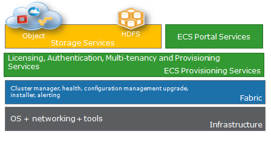
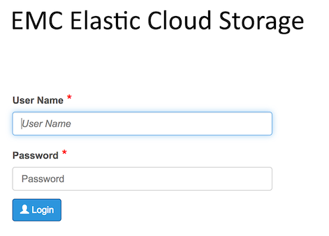
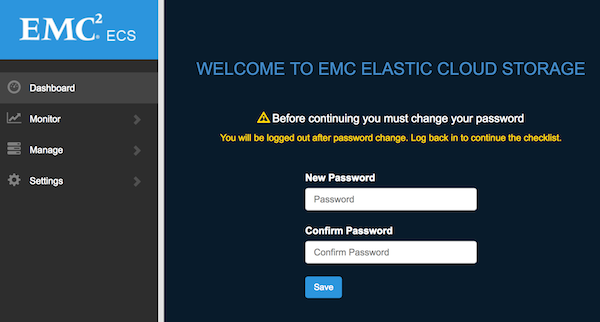
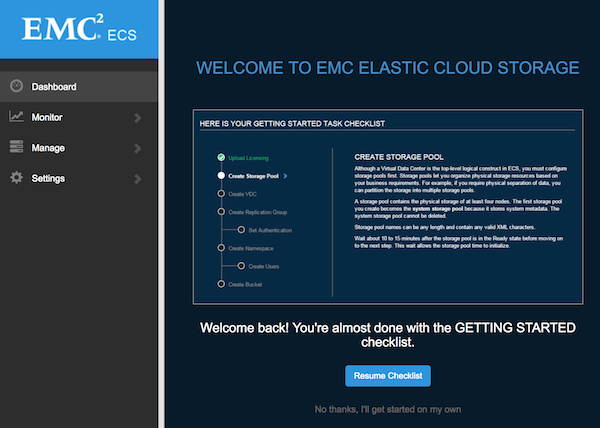
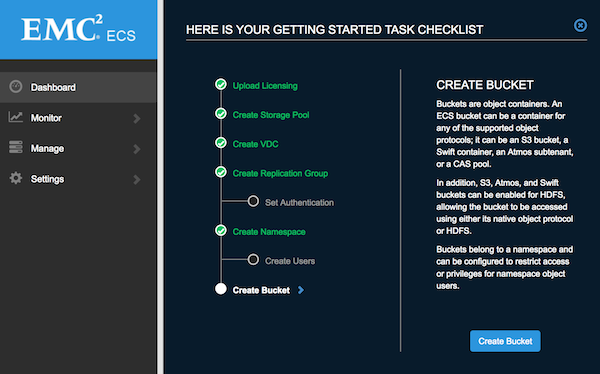
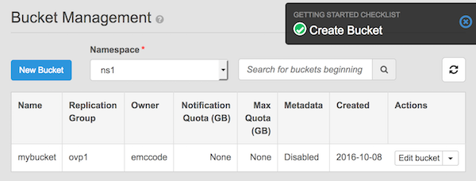
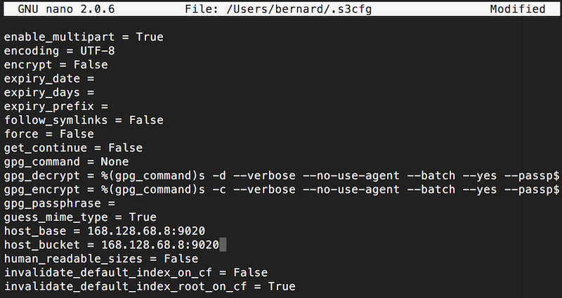
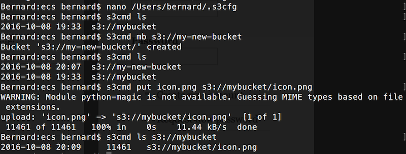

# EMC Elastic Cloud Storage (ECS), for development

The objective of this use case is to deploy a EMC ECS node at the [Managed Cloud Platform from Dimension Data](http://cloud.dimensiondata.com/eu/en/).
This is done with [plumbery](https://docs.mcp-services.net/display/PLUM/Plumbery) and a template that is provided below.

[EMC Elastic Cloud Storage (ECS)](https://www.emc.com/storage/ecs/solutions.htm) brings all the benefits of a public cloud to your own datacenter while keeping your cost under control. It can be used for a wide variety of workloads such as deep archive, geo protection of Hadoop, Internet of Things and many more.
ECS offers universal accessibility with support for industry standard object APIs (Amazon S3, OpenStack Swift, EMC’s Atmos & CAS) and HDFS interfaces. ECS provides a flexible platform to create and integrate an infinite number of modern applications.

Here we deploy a single node ECS, as a virtual machine, that is provided free of license with no time limit for non-production use. In about 30 minutes you can can get a fully-functional ECS back-end, then code and test cloud applications, access a broad range of object API’s like S3 and OpenStack, or deploy a proof of concept (POC) environment.

## Requirements for this use case

* Select a MCP location
* Add a Network Domain
* Add an Ethernet network
* Deploy one Ubuntu nodes with additional CPU, memory and disk
* Monitor all nodes in the real-time dashboard provided by Dimension Data
* Assign a public IPv4 address to the node
* Add address translation rules to ensure Internet connectivity
* Add firewall rule to accept TCP traffic for ssh, web, S3, Swift
* Update the operating system
* Synchronise node clock with NTP
* Install a new SSH key to secure remote communications
* Configure SSH to reject passwords and to prevent access from root account
* Update `etc/hosts` and `hostnames` to bind IPv6 addresses to host names
* Install EMC ECS project from GitHub repository

## Fittings plan

[Click here to read fittings.yaml](fittings.yaml)

## Deployment command

    $ python -m plumbery fittings.yaml deploy

This command will build fittings as per the provided plan, start nodes
and bootstrap them. Look at messages displayed by plumbery while it is
working, so you can monitor what's happening.

## Follow-up commands

At the end of the deployment, plumbery will display on screen some instructions
to help you move forward. You can ask plumbery to display this information
at any time with the following command:

    $ python -m plumbery fittings.yaml information

In this use case you can use the IPv4 assigned for direct ssh
connection.

    $ ssh centos@<ipv4_of_the_queen_here>

From there you will take note of your access credentials:

    $ grep SecretKey /var/log/cloud-init-output.log

Then open a web browser and use the link provided by plumbery for going to the ECS web console.

Provide user name `root` and password `ChangeMe`. This will display the welcome screen.

After you provide a brand new password, the system will force you to login again. The ECS console will display a nice checklist on your return.

From there you can resume the checklist and create a first bucket;

Then to demonstrate remote access over the S3 protocol, you would install `s3cmd` from the command line.
Go to http://s3tools.org/s3cmd for download instructions. On Mac you can use `brew install s3cmd` within Terminal.

    $ s3cmd --configure

Configure s3cmd with access credentials noted before (name as AWS Key and password as AWS Secret).
Also, decline to use HTTPS. Do not attempt to test the configuration either.
The interactive configuration does not allow you to mention the private ECS endpoint that has been created
by plumbery, so you have to do it manually.

    $ sudo nano ~/.s3cfg

Look for the lines `host_base` and `host_bucket` and mention both the public IP address of the ECS node and the port 9020.

Now you can save changes and access the bucket that was created in the ECS console. For example

    $ s3cmd info s3://mybucket

The screenshot below reflects a successful test session.

## Destruction commands

Launch following command to remove all resources involved in the fittings plan:

    $ python -m plumbery fittings.yaml dispose

## Use case status

- [x] Work as expected

## See also

- [Storage with plumbery](../)
- [All plumbery fittings plan](../../)

