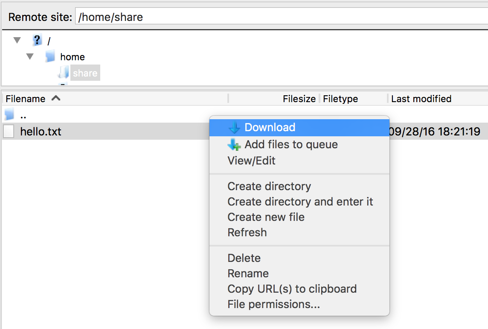
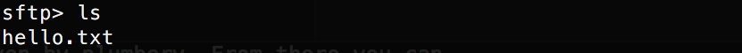

# Secured storage with SFTP (SSH File Transfer Protocol)

In this use case we deploy a file server that is secured by SSH, at the [Managed Cloud Platform from Dimension Data](http://cloud.dimensiondata.com/eu/en/).
This is done with [plumbery](https://docs.mcp-services.net/display/PLUM/Plumbery) and a template that is provided below.

[SFTP](https://en.wikipedia.org/wiki/SSH_File_Transfer_Protocol), the SSH File Transfer Protocol, is a network protocol that provides file access, file transfer, and file management over any reliable data stream.
SFTP is not FTP run over SSH, but rather a new protocol designed by the Internet Engineering Task Force (IETF) as an extension of the Secure Shell protocol (SSH) version 2.0 to provide secure file transfer capabilities.

Here we will ask plumbery to deploy a Linux server with built-in SSH, add a SFTP server, and add a user account to handle files remotely.

## Requirements for this use case

* Select a MCP location
* Add a Network Domain
* Add an Ethernet network
* Deploy a Ubuntu server
* Provide 2 CPU and 4 MB of RAM
* Add a virtual disk of 50 GB
* Monitor this server in the real-time dashboard provided by Dimension Data
* Assign a public IPv4 address
* Add address translation to ensure end-to-end IP connectivity
* Add firewall rule to accept TCP traffic on port 22 (ssh)
* Combine virtual disks into a single expanded logical volume (LVM)
* Update the operating system
* Synchronise node clock
* Install a new SSH key to secure remote communications
* Prevent SSH access from root account
* Add a user account with no administrative privilege that will access files remotely
* Configure SFTP remote access, including chrooting and other tricks

## Fittings plan

[Click here to read fittings.yaml](fittings.yaml)

## Deployment command

    $ python -m plumbery fittings.yaml deploy

This command will build fittings as per the provided plan, start the server
and bootstrap it. Look at messages displayed by plumbery while it is
working, so you can monitor what's happening.

## Follow-up commands

At the end of the deployment, plumbery will display on screen some instructions
to help you move forward. You can ask plumbery to display this information
at any time with the following command:

    $ python -m plumbery fittings.yaml information

Then from your workstation you can launch FileZilla and add a host, using indications
from plumbery. Remote files are on the right pane, and local drive on the left.
Any data exchanged is securely encrypted during communications.

Also, if you are on a decent Unix workstation, you can use sftp from the command line
using the public IP address that is provided by plumbery:

    $ sftp share@<IP_address_here>

Then provide the random secret password that is also given by plumbery. From there you can
list all files made available to you:

## Destruction commands

Launch following command to remove all resources involved in the fittings plan:

    $ python -m plumbery fittings.yaml dispose

## Use case status

- [X] Work as expected

## See also

- [Storage services with plumbery](../)
- [All plumbery fittings plans](../../)

